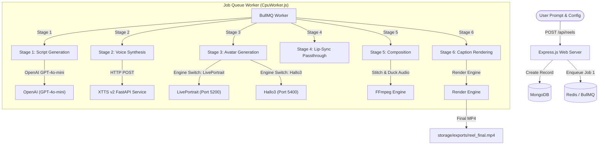

# AdWhiz Avatar Reels Pipeline: System Architecture

This document provides a comprehensive overview of the **AdWhiz Avatar Reels Pipeline**, detailed system architecture, tech stack breakdown, and the technical explanation for the static/looping mouth animation challenge with LivePortrait.

---

## 1. System Architecture Overview

The AdWhiz Avatar Reels system is a **distributed vertical reel generation pipeline**. It accepts a simple text prompt and config parameters, then processes them through six sequential stages to produce a fully composited vertical marketing video complete with a generated voice, an animated spokesperson (avatar), background music, and styled dynamic captions.

### System Workflow Diagram



---

## 2. Tech Stack Breakdown

* **Core Web Backend**: Node.js & Express.js
* **Database & State**: MongoDB (Mongoose) for schema modeling, Redis (BullMQ) for high-performance job queues.
* **UI & Rendering Engine**: Remotion (Server-Side Rendering) for vertical video layouts, dynamic components, and subtitle animations.
* **AI & Media Microservices**:
  * **Text-to-Speech (TTS)**: Python FastAPI wrapper for Coqui XTTS v2 (multilingual voice cloning model running locally).
  * **Avatar Rendering**: 
    * **LivePortrait** (FastAPI on Port 5200): Lightweight keypoint face warping.
    * **Hallo3** (FastAPI on Port 5400): Video Diffusion Transformer talking head animator.
  * **Video Manipulation**: FFmpeg for stitching, stream mapping, volume ducking, and scaling.

---

## 3. The 6-Stage Pipeline Breakdown

Here is how each job is processed sequentially. When a stage completes, the worker updates MongoDB and schedules the next job in the pipeline:

| Stage | Name | Input | Operation | Output |
| :--- | :--- | :--- | :--- | :--- |
| **Stage 1** | **Script Generation** (`script`) | User Prompt | Calls OpenAI GPT-4o-mini to write voice dialogue, visual templates, and scene cues. | Structured script JSON |
| **Stage 2** | **Voice Synthesis** (`voice`) | Script JSON | Sends scene-by-scene dialogues to the XTTS v2 server; stitches outputs with FFmpeg. | `audio.wav` |
| **Stage 3** | **Avatar Generation** (`avatar`) | Static Face + `audio.wav` | Feeds portrait and audio into the chosen avatar engine (LivePortrait or Hallo3). | `avatar.mp4` |
| **Stage 4** | **Lip-Sync** (`lipsync`) | `avatar.mp4` | **[CRITICAL GAP]** Currently a simple passthrough that copies `avatar.mp4` to `composed.mp4`. | `composed.mp4` |
| **Stage 5** | **Media Composition** (`composition`) | `composed.mp4` + Background Music | Merges background track with speech track using FFmpeg, auto-ducking music volume. | `composed.mp4` with full audio |
| **Stage 6** | **Caption Rendering** (`remotion`) | `composed.mp4` + Caption Timings | Uses Remotion Server-Side Rendering (SSR) to overlay styled captions (e.g., Alex Hormozi style) on the video. | `reel_final.mp4` |

---

## 4. Why the Avatar is Only Smiling and Blinking

As you observed, when running E2E, the avatar blinks, shifts its eyeballs, smiles, and moves its head in a loop, but **does not open its mouth to say the words**. 

### The Technical Reason:
1. **LivePortrait is purely Video-Driven**: Unlike older models (like SadTalker), LivePortrait does not natively take an audio file to animate lips. It extracts the expressions, lip positions, and head poses of a **driving video** (a human face talking/moving) and maps those movements onto the static portrait.
2. **Looped driving template**: Currently, `server.py` uses `assets/examples/driving/d0.mp4` (a silent video of a woman smiling, looking around, and blinking) as the driving template. It loops this video to match the duration of the audio.
3. **Current LipSync Passthrough**: In the worker code (`backend/src/workers/CpuWorker.js`), the `lipsync` job is configured as a placeholder. It assumes the avatar video is already lip-synced and simply forwards it:
   ```javascript
   // CpuWorker.js lines 122-127
   if (onProgress) onProgress(50, "[LipSync] LivePortrait output is already lip-synced. Passing through...");
   return { composedVideoPath: sanitizePath(assets.avatarVideoPath) };
   ```

---

## 5. Switchable Dual-Engine Configuration

To support testing Hallo3 alongside LivePortrait, the system configuration has been upgraded with a dual-engine routing switch:

### Backend `.env` configuration:
You can switch the active engine globally by updating the variables in `backend/.env`:

* **To Use LivePortrait (Default)**:
  ```env
  AVATAR_ENGINE=liveportrait
  AVATAR_SERVICE_URL=http://localhost:5200
  ```
* **To Use Hallo3 (Alternative)**:
  ```env
  AVATAR_ENGINE=hallo
  HALLO_SERVICE_URL=http://localhost:5400
  ```

The Node.js `AvatarService` dynamically reads these variables to route generation requests and health checks to the correct FastAPI port seamlessly.
