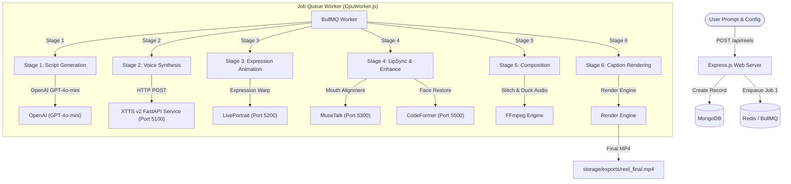

# AdWhiz Avatar Reels Pipeline: System Architecture

This document provides a comprehensive overview of the **AdWhiz Avatar Reels Pipeline**, detailed system architecture, tech stack breakdown, and the technical explanation for the integrated 6-stage video production pipeline.

---

## 1. System Architecture Overview

The AdWhiz Avatar Reels system is a **distributed vertical reel generation pipeline**. It accepts a simple text prompt and config parameters, then processes them through six sequential stages to produce a fully composited vertical marketing video complete with a generated voice, an animated spokesperson (avatar), background music, and styled dynamic captions.

### System Workflow Diagram

---

## 2. Tech Stack Breakdown

* **Core Web Backend**: Node.js & Express.js
* **Database & State**: MongoDB (Mongoose) for schema modeling, Redis (BullMQ) for high-performance job queues.
* **UI & Rendering Engine**: Remotion (Server-Side Rendering) for vertical video layouts, dynamic components, and subtitle animations.
* **AI & Media Microservices**:
  * **Text-to-Speech (TTS)**: Python FastAPI wrapper for Coqui XTTS v2 (multilingual voice cloning model running locally on Port 5100).
  * **Expression Animator (LivePortrait)**: FastAPI on Port 5200 for lightweight keypoint face warping.
  * **LipSync (MuseTalk)**: FastAPI on Port 5300 for high-fidelity audio-driven lip sync (optimized with FP16 and batch size 2).
  * **Face Enhancer (CodeFormer)**: FastAPI on Port 5500 for blind face restoration and super-resolution upsampling.
  * **Video Manipulation**: FFmpeg for stitching, stream mapping, volume ducking, and scaling.

---

## 3. The 6-Stage Pipeline Breakdown

Here is how each job is processed sequentially. When a stage completes, the worker updates MongoDB and schedules the next job in the pipeline:

| Stage | Name | Input | Operation | Output |
| :--- | :--- | :--- | :--- | :--- |
| **Stage 1** | **Script Generation** (`script`) | User Prompt | Calls OpenAI GPT-4o-mini to write voice dialogue, visual templates, and scene cues. | Structured script JSON |
| **Stage 2** | **Voice Synthesis** (`voice`) | Script JSON | Sends scene-by-scene dialogues to the XTTS v2 server; stitches outputs with FFmpeg. | `audio.wav` |
| **Stage 3** | **Expression Animation** (`avatar`) | Static Face + Driving Loop | Warps the source spokesperson face with expressions and eyeblink motion using LivePortrait. | `avatar.mp4` |
| **Stage 4** | **LipSync & Enhance** (`lipsync`) | `avatar.mp4` + `audio.wav` | Synchronizes mouth shape to TTS audio using MuseTalk (FP16), and restores face details/resolution with CodeFormer (fidelity 0.7). | `composed.mp4` |
| **Stage 5** | **Media Composition** (`composition`) | `composed.mp4` + Background Music | Merges background track with speech track using FFmpeg, auto-ducking music volume. | `composed.mp4` with full audio |
| **Stage 6** | **Caption Rendering** (`remotion`) | `composed.mp4` + Caption Timings | Uses Remotion Server-Side Rendering (SSR) to overlay styled captions (e.g., Alex Hormozi style) on the video. | `reel_final.mp4` |

---

## 4. Troubleshooting & Optimizations (RTX 2050 4GB VRAM)

* **VRAM Constraints**: The RTX 2050 has 4GB VRAM. Loading multiple active PyTorch servers requires extending the Windows virtual page file. An automated script (`increase-pagefile.ps1`) is provided to set the system page file to 20GB-24GB.
* **MuseTalk execution**: Inside `server.py` of MuseTalk, execution uses `--use_float16` and `--batch_size 2` to keep VRAM footprint at `3.32 GB` and avoid performance bottlenecks.
* **Axios Request timeouts**: The backend worker Axios timeouts are set to 30 minutes (`1800000ms`) to accommodate cold-starts (e.g. downloading weights) or queuing overheads.
